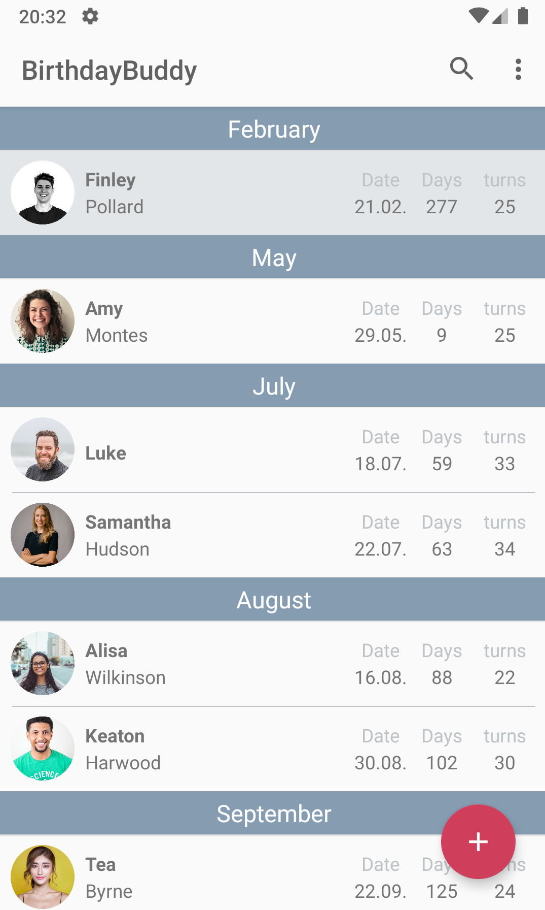
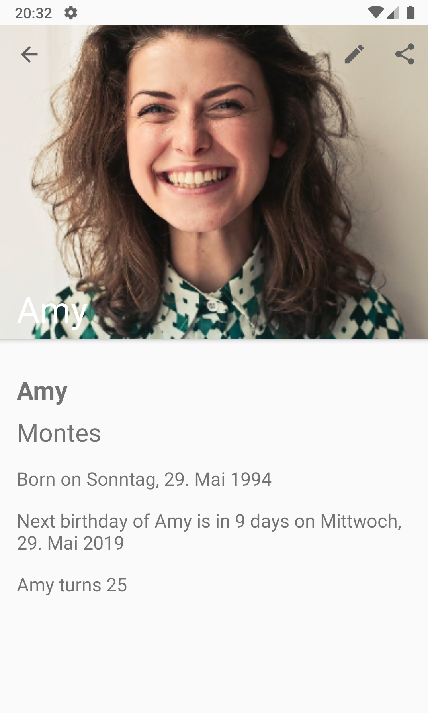
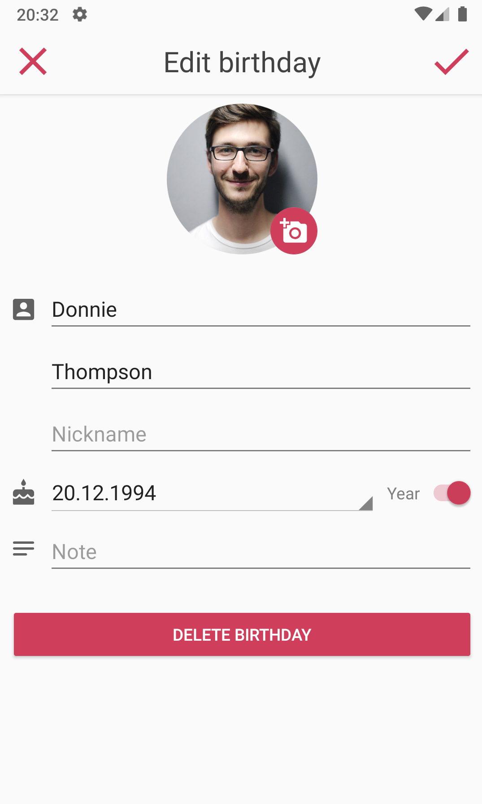
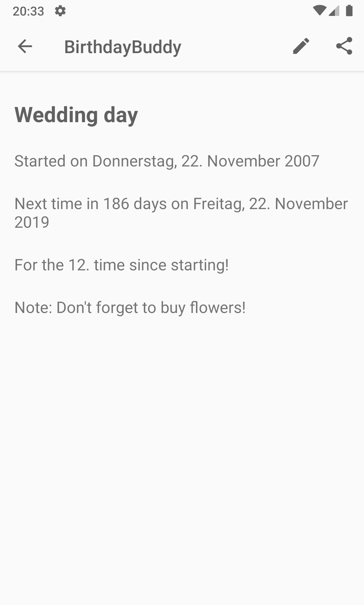
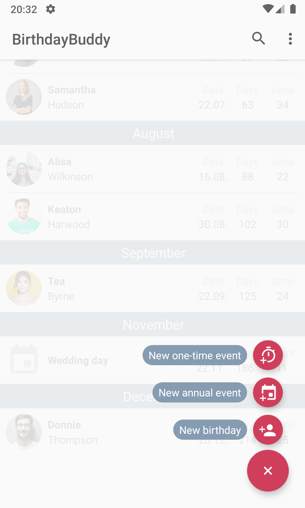

# BirthdayBuddy :birthday:
# What does this app?
This is a simple, material design orientated app to handle all your birthdays, anniversaries and important yearly dates.
You will be reminded about those dates a couple days before they happen (changeable in settings). You can write notes for every event you add and you can set avatar images for your birthdays. For birthdays and annual events you can specify a birthyear or "start-year" to calculate the age of a person, the weekday of their birthday or the n-th time of their occurrence.
You can also add future one-time events like graduation dates, which are automatically deleted after they took place.

# How does it look?
	 
	  

# What are some key features?
- Adding multiple types of events (birthdays, anniversaries, one-time events, ...)
- Custom notification settings for every type of event
- Customization of birthday events with nicknames and avatar images
- Simple material design
- Chronologically presentation of all events grouped in months
- Multiple languages (english, german, [spanish, russian]))
- Event searching
- Export/ Import event dates to not-app storage (SD-Card or phone storage)
- Open-Source
- No need for external internet service for storing data -> no login/ account needed
- Free yourself from the need to lookup birthdays on facebook ;)

# Where is this app available?
- [X] [Google Play](https://play.google.com/store/apps/details?id=com.procrastimax.birthdaybuddy)
- [X] [F-Droid](https://f-droid.org/en/packages/com.procrastimax.birthdaybuddy/)

# How can I contribute?
When you want to inform me about bugs or just want to add any thoughts to this project, feel free to contact me via E-mail (*mmeheykeroth@tutanota.com*) or create a Pull-Request and add your own ideas directly in the code.
